<h2>TensorFlow-FlexUNet-Image-Segmentation-Brain-Stroke-CT (2025/09/19)</h2>

Toshiyuki Arai 
Software Laboratory antillia.com 
 
This is the first experiment of Image Segmentation for <b>Brain Stroke CT (Bleeding and Ischemia) </b> based on 
our <a href="./src/TensorFlowFlexUNet.py">TensorFlowFlexUNet</a>
 (<b>TensorFlow Flexible UNet Image Segmentation Model for Multiclass</b>)
, and a 512x512 pixels PNG dataset with colorized masks (Bleeding:red, Ischemia:green) which was derived by us from 
<a href="https://www.kaggle.com/datasets/ozguraslank/brain-stroke-ct-dataset/data">
<b>Brain Stroke CT Dataset</b> 
CT Image Dataset for Brain Stroke Classification, Segmentation and Detection
</a>
 
 

<b>Actual Image Segmentation for Images of 512x512 pixels</b> 
As shown below, the inferred masks predicted by our segmentation model trained on the 
PNG dataset appear similar to the ground truth masks, but they lack precision in certain areas. 
<b>rgb_map (Bleeding:red, Ischemia:green)</b>  
 
<table>
<tr>

<td></td>
<!--

<th>Input: image</th>
<th>Mask (ground_truth)</th>
<th>Prediction: inferred_mask</th>
 -->
</tr>

<tr>

<td>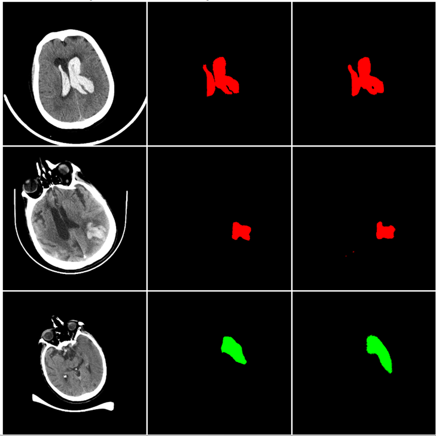</td>

<!--
<td></td>
<td></td>
<td></td>
</tr>
</tr>
<td></td>
<td></td>
<td></td>
</tr>
<tr>
<td></td>
<td></td>
<td>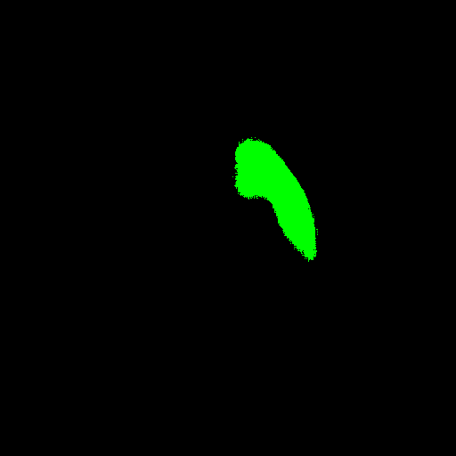</td>

</tr>
-->
</table>

 

<h3>1 Dataset Citation</h3>
The dataset used here was obtained from
  
<a href="https://www.kaggle.com/datasets/ozguraslank/brain-stroke-ct-dataset/data">
<b>Brain Stroke CT Dataset</b> 
CT Image Dataset for Brain Stroke Classification, Segmentation and Detection
</a>
 
<h4>About Dataset</h4>
<b>Description</b> 
The stroke dataset, which includes head computed tomography (CT) cross-sectional images, 
was prepared within the scope of the Artificial Intelligence in Healthcare competition 
held in Istanbul in 2021 with the support of the Ministry of Health, 
General Directorate of Health Information Systems, under the management of the Turkish Health Institutes (TUSEB).
 
Dataset includes images of 6653 CT brain slices with the following distribution:
 
<li>No stroke: 4428 images</li>
<li>Ischemia: 1131 images</li>
<li>Bleeding: 1094 images</li>

<h4>Materials and Methods</h4>

Dataset recorded over the period covering 2019 and 2020 were centrally screened from the e-Pulse and 
Teleradiology System of the Republic of Türkiye, Ministry of Health using various codes and filtering criteria. 
The data set was anonymized. The data set was prepared, pooled, curated, and annotated by 7 radiologists.

<h4>Citation</h4>
Koç U, Akçapınar Sezer E, Alper Özkaya Y, et al.
<a href="https://www.eajm.org/en/artificial-intelligence-in-healthcare-competition-teknofest-2021-stroke-data-set-133405">
 Artificial intelligence in healthcare competition (TEKNOFEST-2021): 
</a>
  
Stroke data set. Eurasian J Med., 2022;54(3):248-258. 

<h4>LICENSE</h4>
The data is collected from https://acikveri.saglik.gov.tr/Home/DataSetDetail/1 and merged into a single folder for ease of use.
 
All legal rights belong to the Republic of Türkiye Ministry of Health.
 
 
<h3>
2 Brain-Stroke-CT ImageMask Dataset
</h3>
<h3>2.1 ImageMask Dataset Generation</h3>
 If you would like to train this Brain-Stroke-CT Segmentation model by yourself,
 you have to generate the PNG dataset by using the following Python scripts:
   
<li><a href="./generator/ImageMaskDatasetGenerator.py">ImageMaskDatasetGenerator.py</a></li>
<li><a href="./generator/split_master.py">split_master.py</a></li>
 

Please put Brain_Stroke_CT_Dataset which was downloaded from the kaggle website under <b>./genrator</b> folder. 
<pre>
./generetor
 ├─ImageMaskDatasetGeneratory.py
 ├─split_master.py
 └─Brain_Stroke_CT_Dataset    # Downloaded from the kaggle website 
      ├─Bleeding
      │  ├─DICOM
      │  ├─OVERLAY
      │  └─PNG
      ├─External_Test
      │  ├─DICOM
      │  ├─MASKS
      │  ├─OVERLAY
      │  └─PNG
      ├─Ischemia
      │  ├─DICOM
      │  ├─OVERLAY
      │  └─PNG
      └─Normal
          ├─DICOM
          └─PNG
</pre>
 
 The first generator script generates a master image and mask dataset
of 512x512 pixels PNG format from <b>OVERLAY</b> and <b>PNG</b>
 in <b>Bleeding</b> and <b>Ischemia</b> under Brain_Stroke_CT_Dataset folder.
 
Each mask is generated from a PNG file in the OVERLAY folder and the corresponding PNG file in the PNG folder,
by subracting the PNG image from the OVERLAY image, and colorizing it with color_map (Bleeding:red, Ischemia:green).
  
 The second splitter simply splits the master into test, train and valid subsets.  

By running these Python scripts, finally a 512x512 pixels PNG Brain-Stroke-CT dataset will be 
created under <b>dataset</b> folder as shown below.<b></b>.  

<pre>
./dataset
└─Brain-Stroke-CT
    ├─test
    │   ├─images
    │   └─masks
    ├─train
    │   ├─images
    │   └─masks
    └─valid
        ├─images
        └─masks
</pre>
<b>Brain-Stroke-CT Statistics</b> 
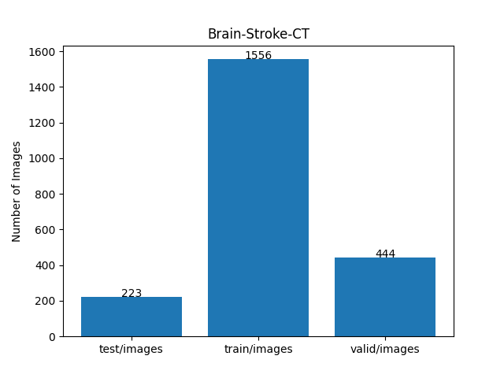 
 
As shown above, the number of images of train and valid datasets is large enough to use for a training set of our segmentation model.
  
<b>You may not redistribute this training dataset generated from 
<a href="https://www.kaggle.com/datasets/ozguraslank/brain-stroke-ct-dataset/data">Brain_Stroke_CT_Dataset</a>, and 
commercial use of this dataset is prohibited.</b>  
 

<h3>2.2 Mini-test Dataset Generation</h3>
You also have to generate a <b>mini_test</b> dataset from <b>Brain-Stroke-CT/test</b> subset by yourself, 
depending on your choices,
which can be used in EpochChangeInferencer Callback and an actual segmentation (predictioin) process.
 
<pre>
./projects
└─TensorflowFlexUNet
       └─Brain-Stroke-CT
             └─mini_test
                ├─images
                └─masks
</pre>
<!--
<b>You may not redistribute your own mini_test dataset.</b> 
-->
 
 
<h3>2.3 Tran Images and Masks Sample </h3>
<b>Train_images_sample</b> 
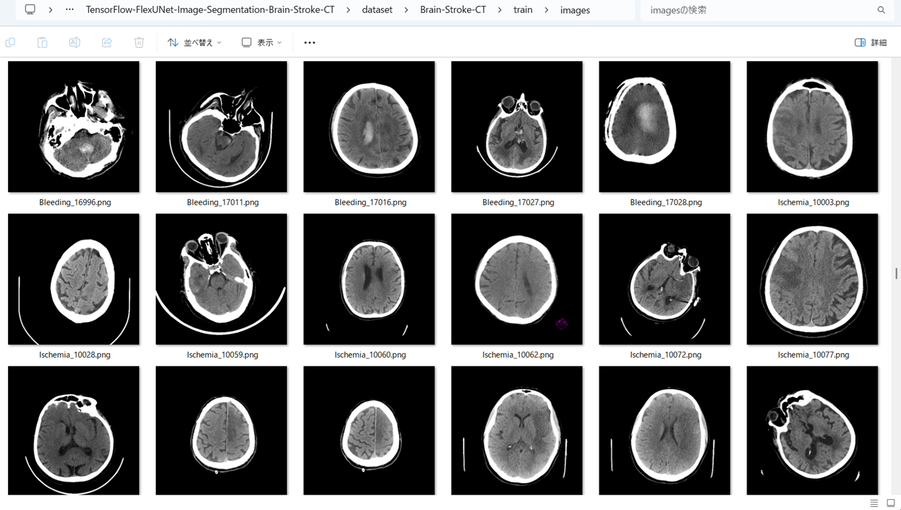
 
<b>Train_masks_sample</b> 
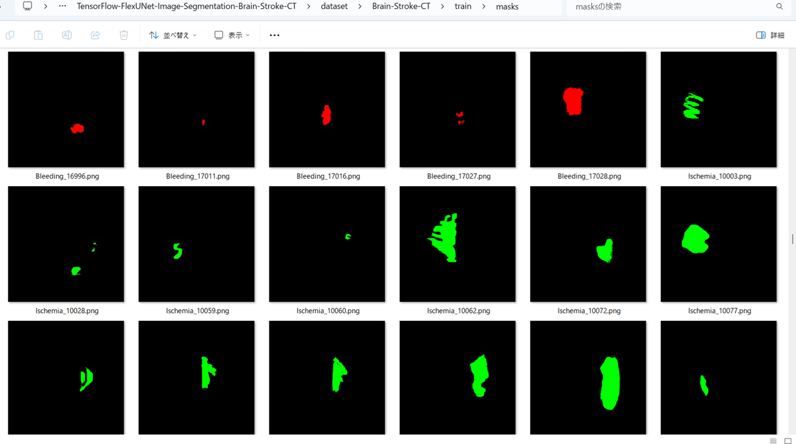
 
 
<h3>
3 Train TensorFlowUNet Model
</h3>
 We have trained Brain-Stroke-CT TensorFlowUNet Model by using the following
<a href="./projects/TensorFlowFlexUNet/Brain-Stroke-CT/train_eval_infer.config"> <b>train_eval_infer.config</b></a> file.  
Please move to ./projects/TensorFlowFlexUNet/Brain-Stroke-CTand, and run the following bat file. 
<pre>
>1.train.bat
</pre>
, which simply runs the following command. 
<pre>
>python ../../../src/TensorFlowUNetTrainer.py ./train_eval_infer.config
</pre>

<b>Model parameters</b> 
Defined a small <b>base_filters = 16</b> and large <b>base_kernels = (9,9)</b> for the first Conv Layer of Encoder Block of 
<a href="./src/TensorFlowUNet.py">TensorFlowUNet.py</a> 
and a large num_layers (including a bridge between Encoder and Decoder Blocks).
<pre>
[model]
image_width    = 512
image_height   = 512
image_channels = 3

num_classes    = 2

base_filters   = 16
base_kernels   = (9,9)
num_layers     = 8
dropout_rate   = 0.04
dilation       = (3,3)

</pre>

<b>Learning rate</b> 
Defined a very small learning rate.  
<pre>
[model]
learning_rate  = 0.00005
</pre>

<b>Online augmentation</b> 
Disabled our online augmentation.  
<pre>
[model]
model         = "TensorFlowUNet"
generator     = False
</pre>

<b>Loss and metrics functions</b> 
Specified "categorical_crossentropy" and <a href="./src/dice_coef_multiclass.py">"dice_coef_multiclass"</a>. 
You may specify other loss and metrics function names. 
<pre>
[model]
loss           = "categorical_crossentropy"
metrics        = ["dice_coef_multiclass"]
</pre>
<b>Learning rate reducer callback</b> 
Enabled learing_rate_reducer callback, and a small reducer_patience.
<pre> 
[train]
learning_rate_reducer = True
reducer_factor     = 0.4
reducer_patience   = 4
</pre>

<b>Early stopping callback</b> 
Enabled early stopping callback with patience parameter.
<pre>
[train]
patience      = 10
</pre>

<b>RGB Color map</b> 
rgb color map dict for Brain-Stroke-CT 1+1 classes.
<pre>
[mask]
mask_datatype    = "categorized"
mask_file_format = ".png"

;Brain-Stroke CT
; rgb color map dict for 3 classes.
;                 Bleeding:red, Ischemia:green
rgb_map = {(0,0,0):0,(255,0,0):1,(0,255,0):2,}

</pre>

<b>Epoch change inference callback</b> 
Enabled <a href="./src/EpochChangeInferencer.py">epoch_change_infer callback (EpochChangeInferencer.py)</a></b>. 
<pre>
[train]
epoch_change_infer       = True
epoch_change_infer_dir   =  "./epoch_change_infer"
num_infer_images         = 6
</pre>

By using this callback, on every epoch_change, the inference procedure can be called
 for 6 images in <b>mini_test</b> folder. This will help you confirm how the predicted mask changes 
 at each epoch during your training process.    

<b>Epoch_change_inference output at starting (epoch 1,2,3)</b> 
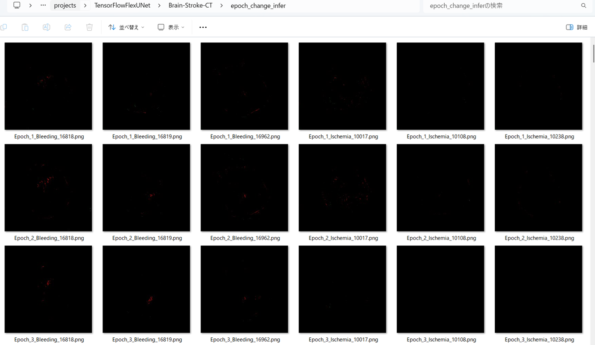 
 
<b>Epoch_change_inference output at middlepoint (epoch 24,25,26)</b> 
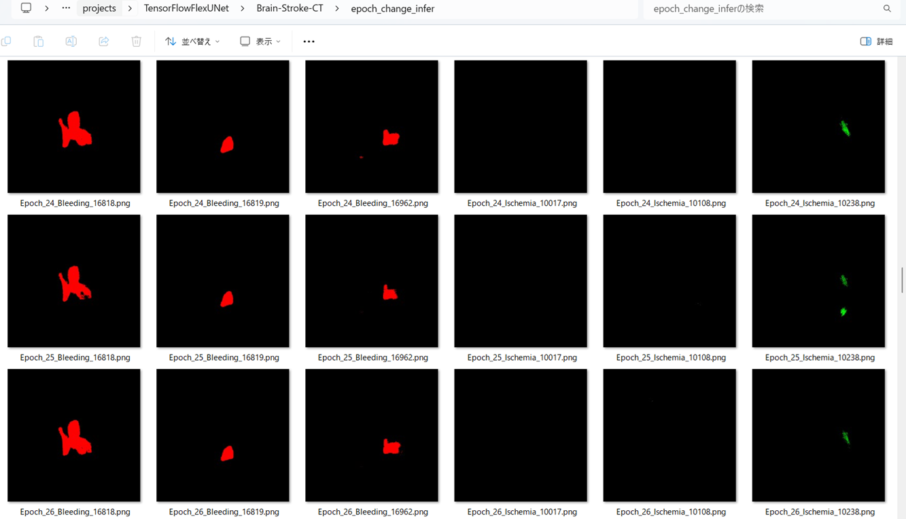 
 

<b>Epoch_change_inference output at ending (epoch 49,50,51)</b> 
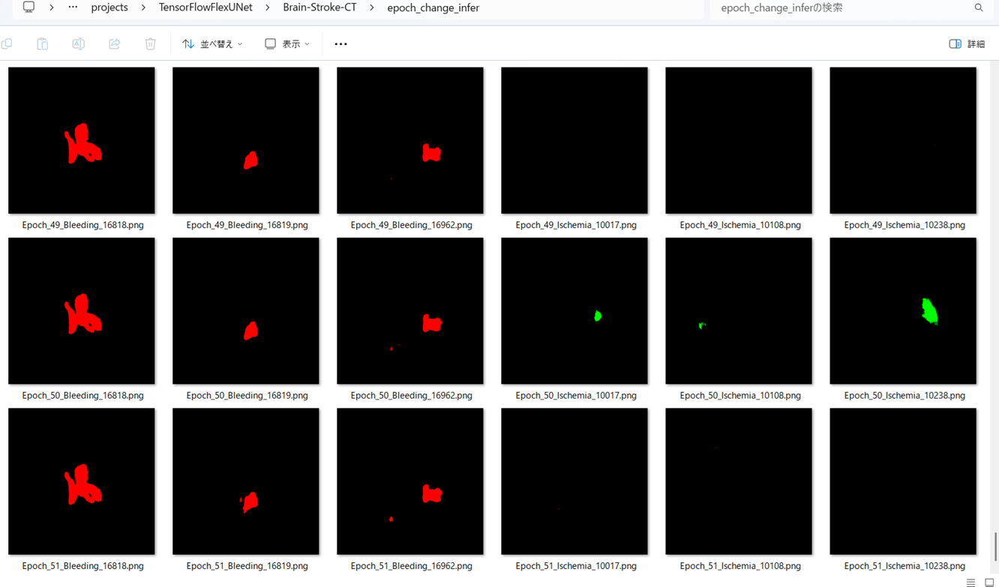 
 

In this experiment, the training process was stopped at epoch 51 by EarlyStopping Callback.  
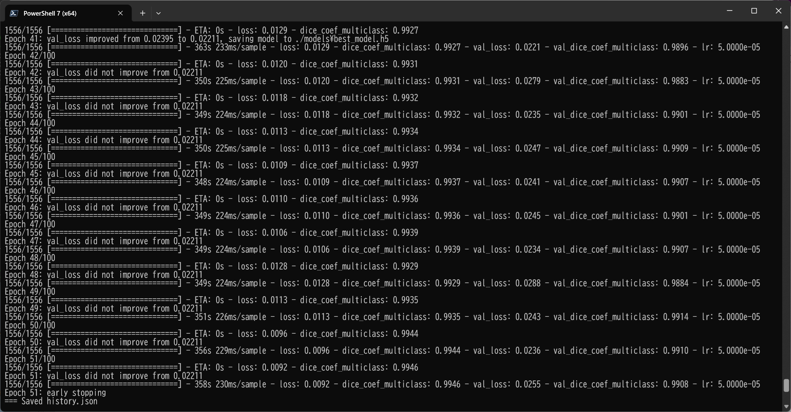 
 

<a href="./projects/TensorFlowFlexUNet/Brain-Stroke-CT/eval/train_metrics.csv">train_metrics.csv</a> 
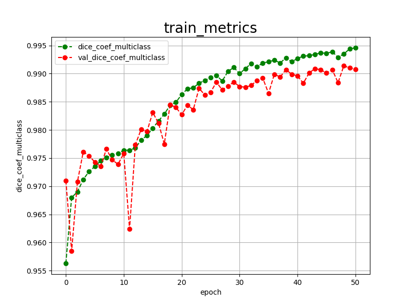 

 
<a href="./projects/TensorFlowFlexUNet/Brain-Stroke-CT/eval/train_losses.csv">train_losses.csv</a> 
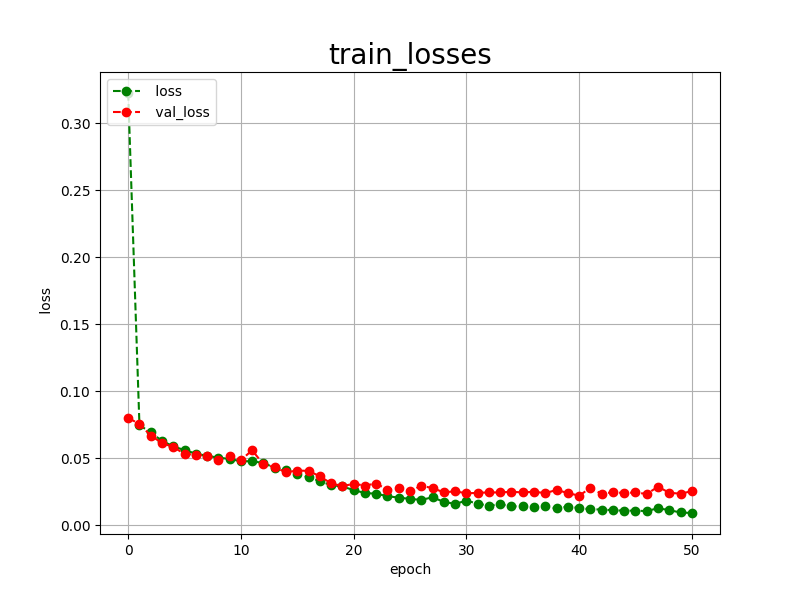 

 

<h3>
4 Evaluation
</h3>
Please move to a <b>./projects/TensorFlowFlexUNet/Brain-Stroke-CT</b> folder, 
and run the following bat file to evaluate TensorFlowUNet model for Brain-Stroke-CT. 
<pre>
./2.evaluate.bat
</pre>
This bat file simply runs the following command.
<pre>
python ../../../src/TensorFlowUNetEvaluator.py ./train_eval_infer.config
</pre>

Evaluation console output: 
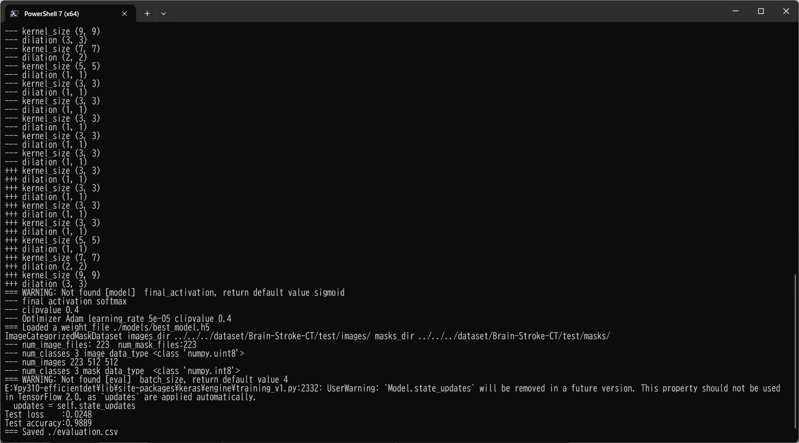
  Image-Segmentation-Brain-Stroke-CT

<a href="./projects/TensorFlowFlexUNet/Brain-Stroke-CT/evaluation.csv">evaluation.csv</a> 

The loss (bce_dice_loss) to this Brain-Stroke-CT/test was low, but dice_coef high as shown below.
 
<pre>
categorical_crossentropy,0.0248
dice_coef_multiclass,0.9889
</pre>
 
<h3>
5 Inference
</h3>
Please move to a <b>./projects/TensorFlowFlexUNet/Brain-Stroke-CT</b> folder 
,and run the following bat file to infer segmentation regions for images by the Trained-TensorFlowUNet model for Brain-Stroke-CT. 
<pre>
./3.infer.bat
</pre>
This simply runs the following command.
<pre>
python ../../../src/TensorFlowUNetInferencer.py ./train_eval_infer.config
</pre>

<b>mini_test_images</b> 
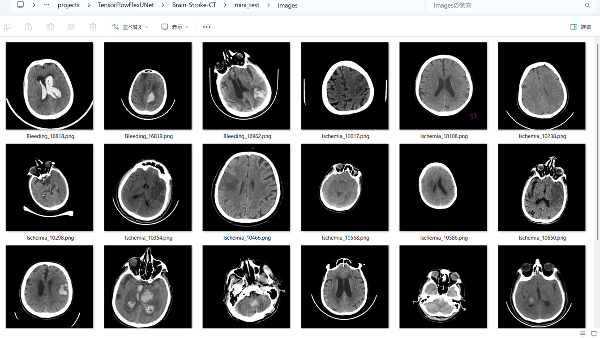 
<b>mini_test_mask(ground_truth)</b> 
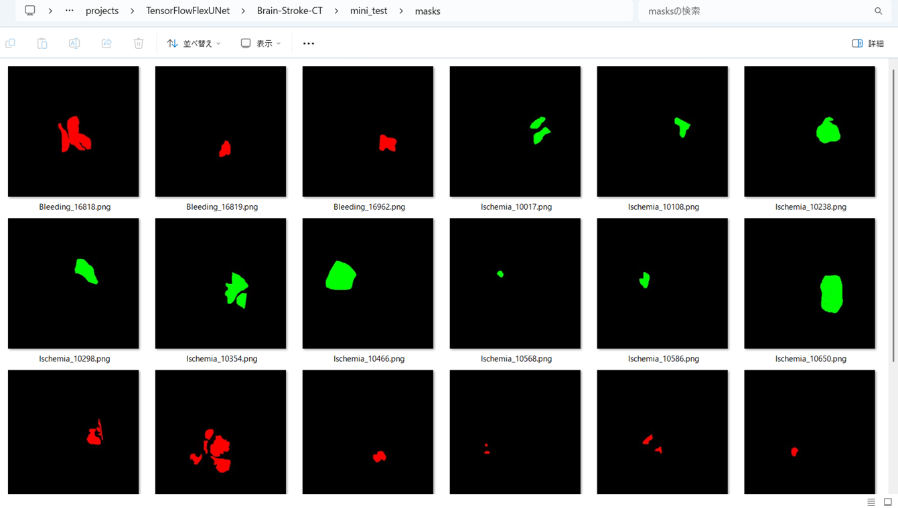 

<b>Inferred test masks</b> 
 
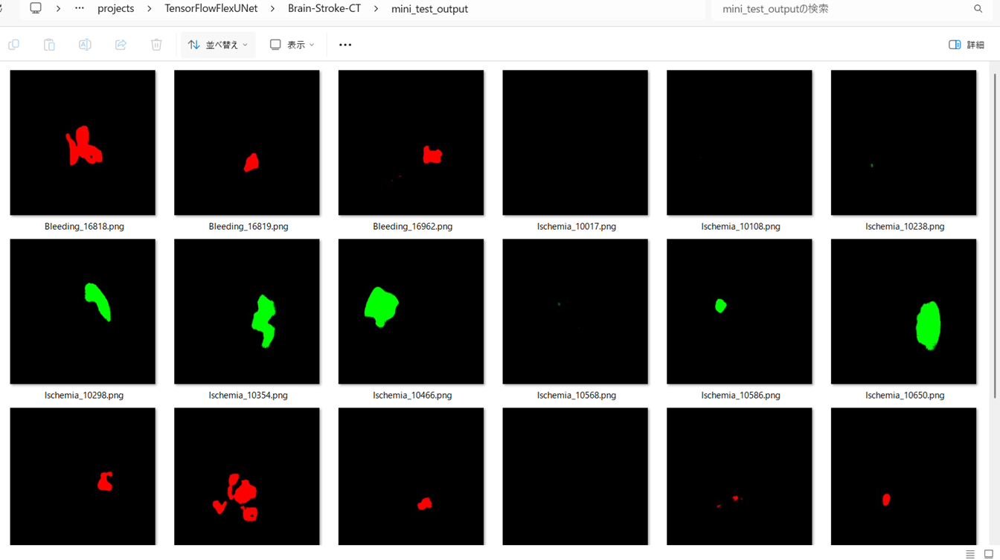 
 

<b>Enlarged images and masks for Images of 512x512 pixels </b> 
As shown below, this segmentation model failed to detect some Bleeding and Ischemia lesions. 

<b>rgb_map (Bleeding:red, Ischemia:green)</b>  
 
<table>

<tr>
<td></td>

<!--
<th>Image</th>
<th>Mask (ground_truth)</th>
<th>Inferred-mask</th>

</tr>
-->

<tr>
<td>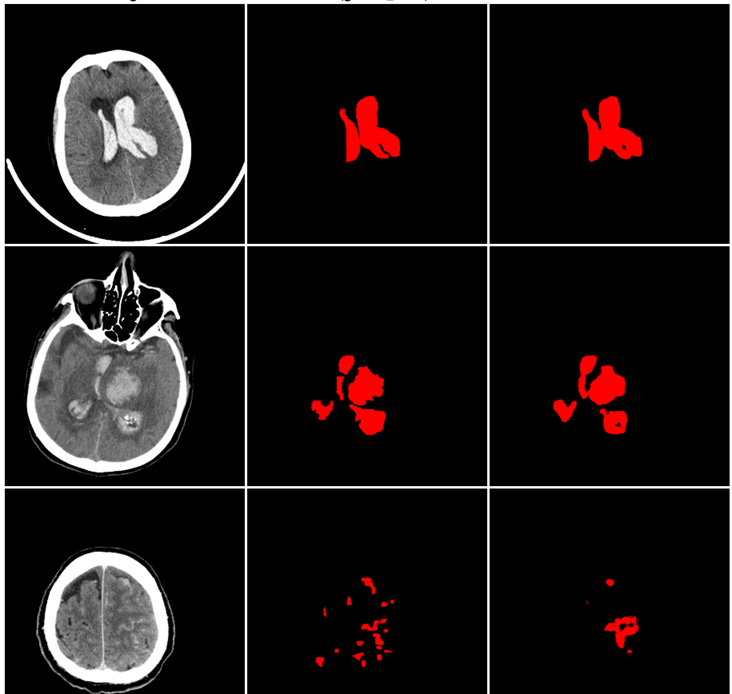</td>

</tr>
<tr>
<td>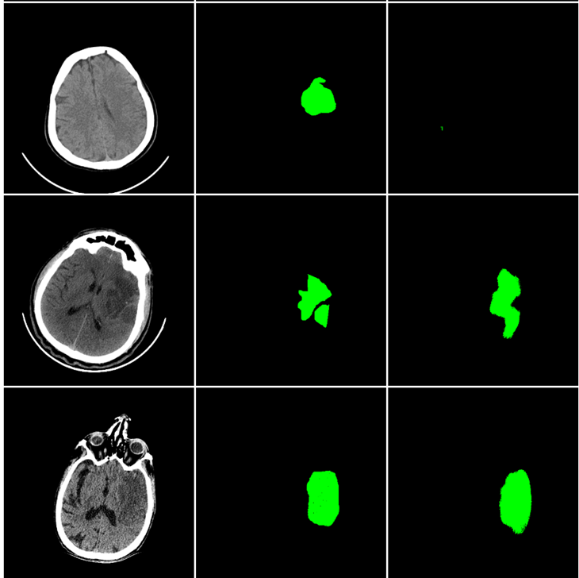</td>

</tr>

 
<!--

<td></td>
<td></td>
<td></td>
</tr>
<tr>
<td></td>
<td></td>
<td></td>
</tr>
<tr>
<td></td>
<td></td>
<td></td>
</tr>
<tr>
<td></td>
<td></td>
<td></td>
</tr>
<tr>
<td></td>
<td></td>
<td>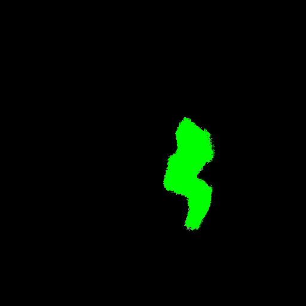</td>
</tr>
<tr>
<td></td>
<td></td>
<td>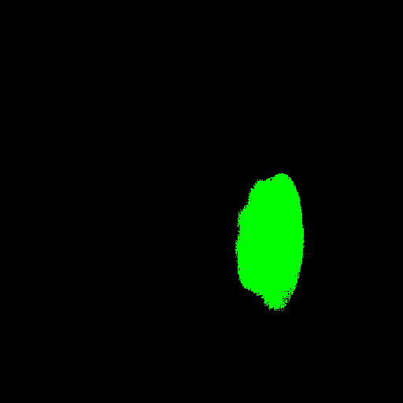</td>
</tr>
-->>
</table>

 

<h3>
References
</h3>
<b>1. Artificial Intelligence in Healthcare Competition (TEKNOFEST-2021):Stroke Data Set</b> 
Ural Koç,, Ebru Akçapınar Sezer, Yaşar Alper Özkaya, Yasin Yarbay4 , Onur Taydaş, 
Veysel Atilla Ayyıldız , Hüseyin Alper Kızıloğlu, Uğur Kesimal, İmran Çankaya, Muhammed Said Beşler, 
Emrah Karakaş, Fatih Karademir, Nihat Barış Sebik, Murat Bahadır , Özgür Sezer, 
Batuhan Yeşilyurt, Songul Varlı, Erhan Akdoğan, Mustafa Mahir Ülgü , Şuayip Birinci 

<a href="https://www.eajm.org/en/artificial-intelligence-in-healthcare-competition-teknofest-2021-stroke-data-set-1618971">
https://www.eajm.org/en/artificial-intelligence-in-healthcare-competition-teknofest-2021-stroke-data-set-1618971
</a>

  
<b>2. Hemorrhagic stroke lesion segmentation using a 3D U-Net with squeeze-and-excitation blocks</b> 
Valeriia Abramova, Albert Clèrigues, Ana Quiles, Deysi Garcia Figueredo, Yolanda Silva, Salvador Pedraza, 
 Arnau Oliver, Xavier Lladó 
<a href="https://www.sciencedirect.com/science/article/pii/S0895611121000574">
https://www.sciencedirect.com/science/article/pii/S0895611121000574
</a>
 
 
<b>3. Segmentation of acute stroke infarct core using image-level labels on CT-angiography</b> 
Luca Giancardo, Arash Niktabe, Laura Ocasio, Rania Abdelkhaleq, Sergio Salazar-Marioni, Sunil A Sheth 
<a href="https://pmc.ncbi.nlm.nih.gov/articles/PMC10011814/">
https://pmc.ncbi.nlm.nih.gov/articles/PMC10011814/
</a>
 
 
<b>4.Segmenting Small Stroke Lesions with Novel Labeling Strategies</b> 
Liang Shang, Zhengyang Lou, Andrew L. Alexander, Vivek Prabhakaran, 
William A. Sethares, Veena A. Nair, and Nagesh Adluru 
<a href="https://arxiv.org/pdf/2408.02929">
https://arxiv.org/pdf/2408.02929
</a>

